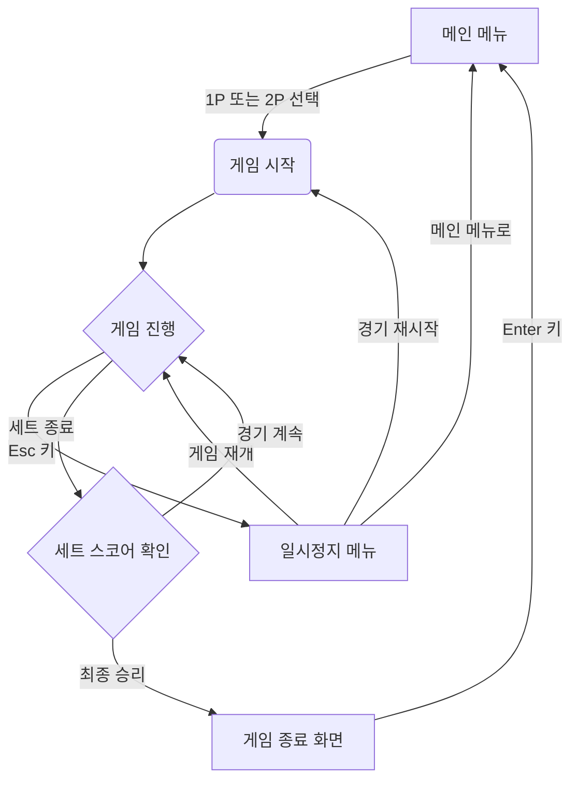
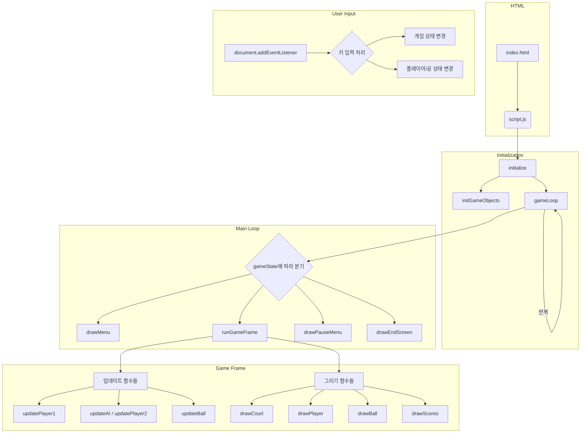

# 비치 발리볼 (Beach Volleyball)

간단한 2D 비치 발리볼 게임입니다. 1인용 또는 2인용으로 즐길 수 있습니다.

## 게임 방법

### 목표
- 상대방 코트에 공을 떨어트려 점수를 획득하세요.
- 한 세트에서 11점을 먼저 내고 듀스가 나올 경우 상대방과 2점 차이가 나면 세트에서 승리합니다.
- 총 3세트를 먼저 이기면 경기에서 최종 승리합니다.

### 조작법

#### 메뉴
- **방향키 위/아래**: 메뉴 항목 선택
- **Enter**: 선택
- **Esc**: (게임 중) 일시정지 메뉴 열기

#### 1인용 모드 (Player vs Computer)
- **Player 1**:
    - **← (왼쪽 방향키)**: 왼쪽으로 이동
    - **→ (오른쪽 방향키)**: 오른쪽으로 이동
    - **↑ (위쪽 방향키)**: 점프

#### 2인용 모드 (Player 1 vs Player 2)
- **Player 1**:
    - **A**: 왼쪽으로 이동
    - **D**: 오른쪽으로 이동
    - **W**: 점프
- **Player 2**:
    - **← (왼쪽 방향키)**: 왼쪽으로 이동
    - **→ (오른쪽 방향키)**: 오른쪽으로 이동
    - **↑ (위쪽 방향키)**: 점프

## 게임 실행 방법
1.  `index.html` 파일을 웹 브라우저에서 엽니다.
2.  메뉴에서 '1 Player' 또는 '2 Players'를 선택하고 'Enter' 키를 누릅니다.
3.  게임을 즐기세요!

## 게임 주소
1. https://hordal.github.io/sillavibe_game/
## 게임 구조 (Game Structure)

## 기능 구조 (Function Structure)

https://gamma.app/docs/-x7vq7xt4eatzdzm
